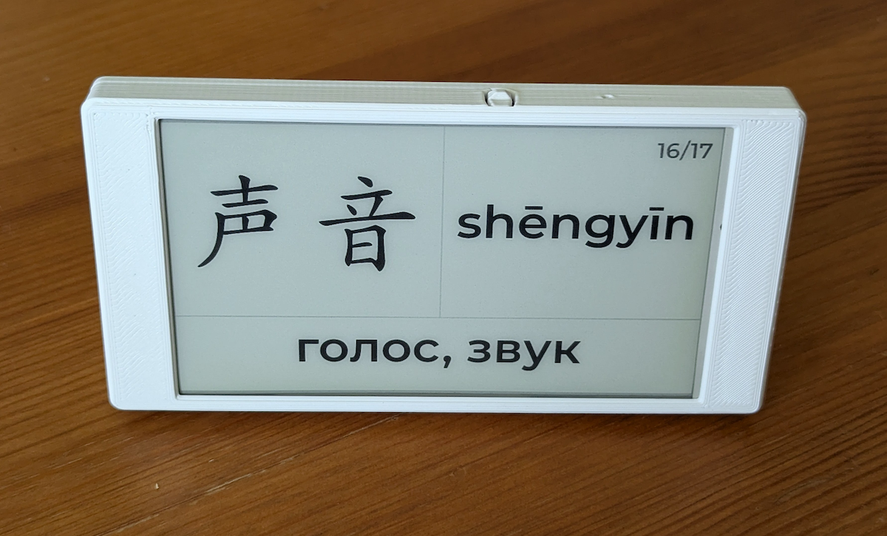

# HanziFrame

E-Ink display for Chinese character learning, powered by ESPHome and Home Assistant.

  <!-- Замени на реальное фото -->

This project turns a LilyGo T5 4.7" E-Ink display into a "digital flashcard" that periodically shows a new Chinese word, its pinyin transcription, and  translation to your preferred language. The core logic runs on a Home Assistant server, making the ESP32 device a simple and efficient "thin client".

## Features

*   **Server-Side Rendering:** The image is generated by a Python script in Home Assistant, which gives full control over the design and frees up the ESP32's resources.
*   **Automatic Updates:** A new word is displayed at a configurable interval (e.g., every 15 minutes).
*   **Custom Word Lists:** Easily add your own vocabulary using a simple CSV file.
*   **3D-Printable Case:** A sleek, open-source case is available to house the electronics.

## How It Works

1.  **Home Assistant:**
    *   A **Pyscript** Python script (`word_generator.py`) reads a word from a CSV file.
    *   It generates a 960x540 pixel PNG image with the chinese word, pinyin, and translation. The image is inverted (white text on a black background) to be correctly displayed on the E-Ink screen.
    *   This image is saved to the `/config/www/` directory, making it accessible via a local URL.
    *   An **Automation** triggers this script periodically (e.g., every 15 minutes) and then calls a service on the ESPHome device to refresh the display.

2.  **ESPHome Device (LilyGo T5):**
    *   The device acts as a thin client. It doesn't do any font rendering.
    *   When triggered by Home Assistant, it downloads the pre-rendered PNG image from the local server.
    *   It displays this image on the E-Ink screen.

## Hardware Required

*   [LilyGo T5-4.7 Inch E-Paper (ESP32-S3)](https://lilygo.cc/products/t5-4-7-inch-e-paper-v2-3)
*   A running Home Assistant instance.
*   (Optional) 3D printer for the case.

## Software & Setup

### Home Assistant Configuration

You need the [Pyscript integration](https://hacs-pyscript.readthedocs.io/en/latest/installation.html) installed in your Home Assistant.

1.  **Copy Files:** Copy the `pyscript` directory from this repository into your Home Assistant's `<config>` directory. The final path should look like `<config>/pyscript/...`.

2.  **Install Dependencies:** The `requirements.txt` file lists the necessary Python library (`Pillow`). Pyscript should install it automatically.

3.  **Create Word List:**
    *   Navigate to `<config>/pyscript/apps/chinese_display/data/`.
    *   Edit `chinese_words.csv` and fill it with your own words. The columns are `chinese`, `pinyin`, `translation`.

4.  **Add Automation:** Copy the code from `homeassistant/automation.yaml` into your `automations.yaml` file in Home Assistant, or create a new automation via the UI using this logic.

### ESPHome Device Setup

This project relies on a custom component that has compatibility issues with the latest versions of ESPHome due to breaking changes in them. It is recommended to use ESPHome `v2024.12.4`. A convenient way to install it alongside a newer version in Home Assistant is by using the [esphome-legacy-addons](https://github.com/khenderick/esphome-legacy-addons) repository.

**Instructions:**

1.  **Install the Custom Component:**
    *   Navigate to your ESPHome configuration directory (the one where your `.yaml` files are stored).
    *   If it doesn't already exist, create a new folder named `custom_components`.
    *   Download the source code of the [esphome-lilygo-t547plus component from its GitHub repository](https://github.com/nickolay/esphome-lilygo-t547plus).
    *   Unzip the downloaded file and place its contents into the `custom_components` folder. The final file structure should look like this:
        ```
        <esphome_config>/
        ├── custom_components/
        │   └── t547/
        │       ├── __init__.py
        │       ├── display.py
        │       └── ... (other component files)
        └── ... (your yaml files)
        ```
        
   **Component Modification:** You must manually edit the `display.py` file of the custom component. Open the file at `<esphome_config>/custom_components/t547/display.py` and add the following lines inside the `to_code` function to ensure proper compilation:
   
    ```
    cg.add_build_flag("-DCONFIG_RMT_SUPPRESS_DEPRECATE_WARN=1")
    cg.add_build_flag("-DCONFIG_RMT_ISR_IRAM_SAFE=0")
    
    cg.add_library("Wire", None)  # required by LilyGoEPD47
    cg.add_library("SPI", None)   # adding SPI
    ```
    
2.  **Copy the ESPHome Configuration:**
    *   Copy the `esphome/lilygo-display.yaml` file from this repository into your ESPHome configuration directory.

3.  **Edit the Configuration:**
    *   Open `lilygo-display.yaml` with a text editor.
    *   Change your Wi-Fi credentials (it's recommended to use secrets: `!secret wifi_ssid`, `!secret wifi_password`).
    *   Set your own API encryption key and OTA password.

4.  **Flash the Device:**
    *   Compile and upload the configuration to your LilyGo T5 display using the ESPHome dashboard.

### 3D-Printed Case (Optional)

Details on the 3D-printable case can be found [here](https://www.printables.com/model/741304-lilygo-t5-47-inch-case).

**Notes on Fitment and Assembly**

Based on my experience, you might encounter minor fitment issues with the 3D-printed case, especially with recent revisions of the LilyGo T5 board:

*   **Tight Fit:** The board itself can be a very tight fit, potentially requiring slight modification (e.g., trimming a couple of millimeters off a corner) to fit comfortably into the case.
*   **USB-C Port:** The opening for the USB-C port is quite narrow. I was able to use a slim Apple USB-C cable, but cables with larger plastic housings may not fit.
*   **Button Alignment:** The button on the printed case might not perfectly align with the physical button on the board.

It's likely that these minor issues are due to small changes in the LilyGo board revision rather than the 3D model itself. If you have 3D modeling skills, it is recommended to first take precise measurements of your specific board and make small adjustments to the model before printing.

For assembly, I used **M2x4x3.2** heated inserts and **M2x5** screws.

## Customization

*   **Update Interval:** Change the trigger in the Home Assistant automation (default is every 15 minutes).
*   **Image Design:** Modify `word_generator.py` to change fonts, colors, layout, and sizes.
*   **Display Component:** This project uses a local copy of the [esphome-lilygo-t547plus](https://github.com/nickolay/esphome-lilygo-t547plus) component to ensure compatibility.

## Attribution & License

This project is licensed under the MIT License. See the [LICENSE](./LICENSE) file for details.

*   **Fonts:**
    *   `AR PL KaitiM GB` is used under the [Arphic Public License](https://github.com/gkopiev/HanziFrame/blob/main/pyscript/apps/chinese_display/fonts/ARPHIC_LICENSE.txt).
    *   `Montserrat` is used under the [SIL Open Font License 1.1](https://github.com/gkopiev/HanziFrame/blob/main/pyscript/apps/chinese_display/fonts/MONTSERRAT_LICENSE.txt).
*   **3D Model:** The case was designed by Vladimir Varzaru and is licensed under [CC BY 4.0](http://creativecommons.org/licenses/by/4.0/). Original model can be found [here](https://www.printables.com/model/741304-lilygo-t5-47-inch-case).
