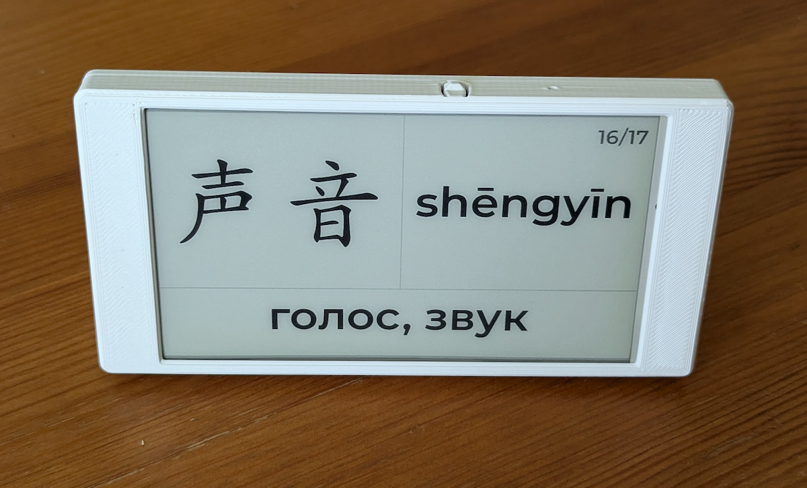
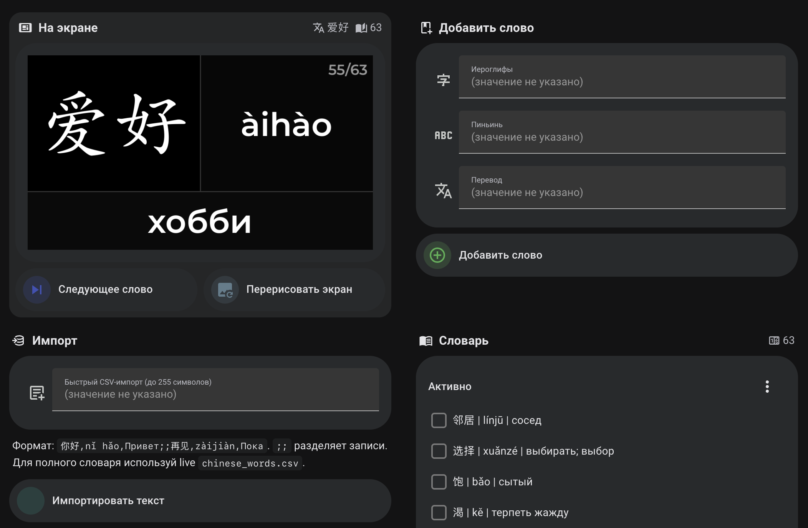

# HanziFrame

[English](README.md) · **Русский**

**Китайские слова всегда перед глазами.**

HanziFrame — это умный дисплей, помогающий учить китайские слова. Он отображает
и регулярно чередует словарные карточки с иероглифами, пиньинем и переводом.
Карточку также можно сменить по кнопке, а словарём можно управлять со смартфона
через дашборд Home Assistant.

**[Что понадобится](#что-понадобится) ·
[Полная инструкция](docs/INSTALL.ru.md) ·
[Установка с ИИ](#установка-с-ии-агентом)**

  

## Как это работает

Home Assistant выбирает следующее слово и готовит для него законченный кадр.
Дисплей скачивает эту картинку по локальной сети и сохраняет её на экране до
следующего обновления. Для обычной работы HanziFrame не нужны облачные API:
словарь, логика и изображения остаются в вашей домашней сети.

## Как пользоваться

1. Добавьте слово с телефона: иероглифы, пиньинь и перевод. Можно также вставить
   сразу несколько строк или импортировать CSV.
2. Дождитесь обновления по расписанию или нажмите кнопку следующего слова на
   дашборде Home Assistant.
3. Отметьте выученное слово выполненным в списке Todo — оно перестанет появляться
   на дисплее, но останется в словаре.

Слова можно редактировать и удалять прямо в Home Assistant. Перевод может
содержать любые символы, которые есть во встроенном шрифте; стартовый словарь
использует русский перевод. Интервал смены карточек тоже настраивается.

  
   
  Дашборд Home Assistant: текущая карточка, управление экраном, добавление и импорт слов и словарь Todo.

## Что понадобится

Основные компоненты:

- [LILYGO T5 4.7″ E-Paper](https://lilygo.cc/products/t5-4-7-inch-e-paper-v2-3)
  на базе ESP32-S3;
- работающий сервер Home Assistant и Wi-Fi;
- USB-C-кабель с передачей данных для первой прошивки;
- стабильное USB-питание для постоянной работы.

Плату можно использовать без корпуса. Для аккуратной настольной сборки на фото
использован [корпус по модели Vladimir Varzaru](https://www.printables.com/model/741304-lilygo-t5-47-inch-case),
распространяемой по CC BY 4.0. Файлы модели в этот репозиторий не входят. Для
показанной сборки использованы термовставки **M2×3.2×4** и винты **M2×5**.

Перед установкой термовставок примерьте плату и подключите USB-C-кабель. У разных
ревизий LILYGO посадка может немного отличаться: плата иногда входит плотно,
проём USB-C рассчитан на тонкий штекер, а кнопка корпуса может не идеально
совпасть с кнопкой на плате. Небольшую подгонку лучше сделать до окончательной
сборки.

## Под капотом

HanziFrame использует дисплей как простой «тонкий клиент»:

- **Home Assistant + Pyscript** ведут словарь, выбирают слово и рисуют готовую
  картинку 960×540;
- **ESPHome** скачивает эту картинку и передаёт её E-Ink-панели;
- **Local Todo** служит основным словарём, а CSV — удобным способом массового
  импорта;
- драйвер дисплея **t547** уже включён в репозиторий — отдельно скачивать и
  исправлять его не нужно.

Проект проверен в связке **Home Assistant Core 2026.8.1**, **Pyscript 2.0.1** и
**ESPHome 2026.7.4** на LILYGO T5 4.7″ ESP32-S3. При переходе на другие версии
совместимость дисплейного драйвера стоит проверить заново.

## Установка

HanziFrame — DIY-проект, а не готовый Home Assistant add-on с установкой одной
кнопкой. Нужно добавить часть проекта в Home Assistant, один раз прошить
дисплей по USB и связать их в локальной сети. Все исходники, шрифты,
эталонные автоматизации и встроенный драйвер из проверенной связки уже
находятся в репозитории.

**[Открыть полную инструкцию по установке →](docs/INSTALL.ru.md)**

Она описывает весь путь от скачивания проекта до первого кадра на экране. Для
уже настроенных Home Assistant и ESPHome там отдельно объяснено, как добавить
HanziFrame, не перезаписывая существующую конфигурацию целиком.

## Установка с ИИ-агентом

Для установки с Codex, Claude Code или другим coding agent начните новую задачу с
одного запроса:

> Помогите мне установить и настроить у себя проект
> `https://github.com/gkopiev/HanziFrame`.

Все дальнейшие шаги и правила безопасной установки агент найдёт в самом
репозитории.

## Лицензии и благодарности

Оригинальные код и документация HanziFrame распространяются по
[лицензии MIT](LICENSE). Сторонние компоненты, шрифты и медиа сохраняют
собственные условия; подробности — в
[уведомлениях о сторонних материалах](THIRD_PARTY_NOTICES.md).

Фото устройства и авторский вклад в скриншот: © 2025–2026 gkopiev, CC BY 4.0.
Интерфейс стороннего ПО сохраняет собственные условия — подробности приведены в
[уведомлении о медиа](assets/LICENSE.md). Порядок сообщения об уязвимостях
описан в [политике безопасности](SECURITY.md).
